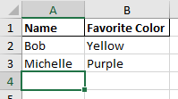

# HtmlTableToExcel
Converting HTML tables to Excel 

## Install

Library can be installed through Nuget.

```
PM> Install-Package HtmlTableToExcel
```

### Sample HTML table: 


### Excel File:




## Usage
### Convert from html table
```csharp
string html = "<table><tr><th>Name</th><th>Favorite Color</th></tr><tr><td>Bob</td><td>Yellow</td></tr><tr><td>Michelle</td><td>Purple</td></tr></table>";

HtmlTableToExcel tableToExcel = new HtmlTableToExcel();

byte[] converted = tableToExcel.Process(html);

```


### Convert from html div
Use data-export tag for defining table, row and cell
```html
<div data-export="table">
	<div data-export="row">
		<div data-export="cell">Name</div>
		<div data-export="cell">Favorite Color</div>
	</div>
	<div data-export="row">
		<div data-export="cell">Bob</div>
		<div data-export="cell">Yellow</div>
	</div>
	<div data-export="row">
		<div data-export="cell">Michelle</div>
		<div data-export="cell">Purple</div>
	</div>
</div>
```
```csharp
string html = "<div data-export='table'><div data-export='row'><div data-export='cell'>Name</div><div data-export='cell'>Favorite Color</div></div><div data-export='row'><div data-export='cell'>Bob</div><div data-export='cell'>Yellow</div></div><div data-export='row'><div data-export='cell'>Michelle</div><div data-export='cell'>Purple</div></div></div>";

var parser = new Parsers.DataAttributeParser();
HtmlTableToExcel tableToExcel = new HtmlTableToExcel(parser);

byte[] converted = tableToExcel.Process(html);
```

# Licence
MIT licence (permits usage in commercial applications)
